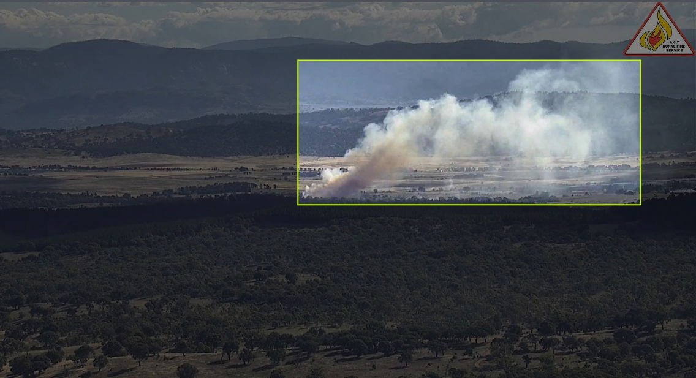

# Deep-Bushfire-Detection
This project aims to study how different state-of-the-art detection / segmentation model's perform on our smoke data obtained from fire tower cameras around the ACT. The goal is to apply both weakly-supervised learning with bounding-box labels, as well as fully-supervised learning with fully labelled image segmentations to the models and evaluate their performance. 

# Data preparation
I first extracted the smoke footages as frames and labelled them individually on MATLAB using the image labeller tool in the toolbox. Then, after obtaining a matrix of gTruth box values, I converted each row of the matrix as its own individual .txt file and saved them at `data/boxLabels`. After that, applying `creat_coco.py` to create a coco-json formatted dataset. This will allow easier data application to other exisiting models. After that, I uploaded both my images and its coco json annotations to roboflow to generate a dataset. This dataset set is now made avaible to public through this link: https://app.roboflow.com/honours/deep-smoke-detection/2 

This part of the code can be used for custom coco dataset creation, feel free to replace `data` folder with your own set of testing, training and box labels. 

# Faster-RCNN Object Detection with Pytorch
The first part of this project involes data preparation (bounding-box labelling) and applying Faster-RCNN for object detection. My training and modelling codes follows closely to this tutorial on custom object detection with Faster-RCNN by Sovit Ranjan RathSovit Ranjan Rath (https://debuggercafe.com/custom-object-detection-using-pytorch-faster-rcnn/).

# Contact 
Please feel free to contact me at charlotte.kwong@anu.edu.au
