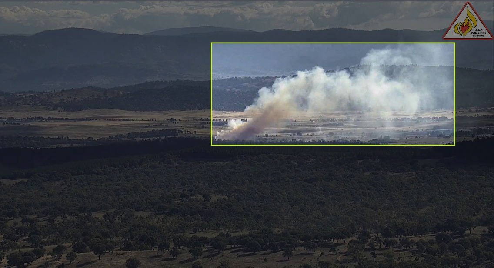
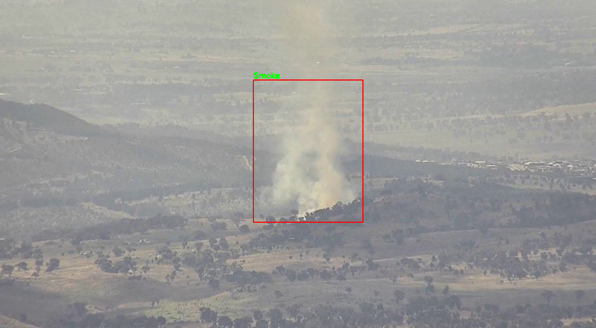
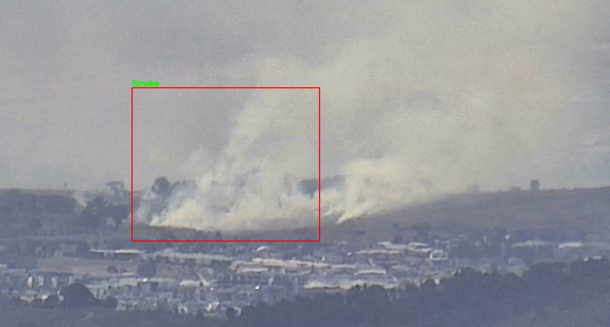
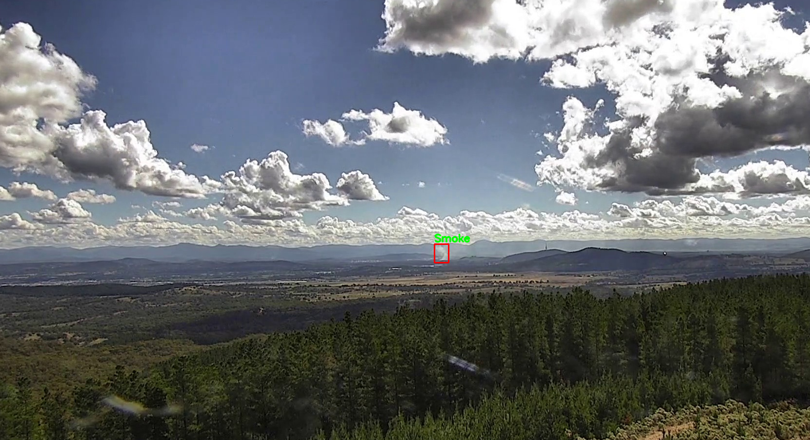

# Deep-Bushfire-Detection
  

*Click on image to view the current detection model tested on test videos. Alternatively: https://www.youtube.com/watch?v=TxacQpGA7D0

This project aims to study how different state-of-the-arts detection / segmentation models would perform on our smoke data obtained from fire tower cameras around the ACT. The goal is to apply both weakly-supervised learning with bounding-box labels, as well as fully-supervised learning with fully labelled image segmentations to the models and evaluate their performance. 

The dataset features 2686 bounding-box labelled smoke images, 1879 has been assigned for training, 393 for validation and 396 for testing.

⛔️ Please note this model is a work-in-progress and is not suitable for use as a fail-safe bushfire detection system.
*Note (23/5/2022): There is currently issues with uploading the 'outputs' folder containing my trained model and an mp4 test video showcase due to its large file size.

# Data preparation
I first extracted the smoke footages as frames and labelled them individually on MATLAB using the image labeller tool in the toolbox. Then, after obtaining a matrix of gTruth box values, I converted each row of the matrix as its own individual .txt file and saved them at `data/boxLabels`. After that, applying `creat_coco.py` to create a coco-json formatted dataset. This will allow easier data application to other exisiting models. After that, I uploaded both my images and its coco json annotations to roboflow to generate a dataset. This dataset set is now made avaible to public through this link: https://app.roboflow.com/honours/deep-smoke-detection/2 

Below shows an example of a labelled image for training.

This part of the code can be used for custom coco dataset creation, feel free to replace `data` folder with your own set of testing, training and box labels. 

# Faster-RCNN Object Detection with Pytorch and ResNet50 backbone
My training, modelling and testing codes follows closely to this tutorial on custom object detection with Faster-RCNN by Sovit Ranjan RathSovit Ranjan Rath (Please see anowledgement). Work-to-date had shown that there in still much more improvement to be made with the model. While some smoke are detected, a lot of the times when a smoke is spread out or relatively zoomed-in, a detection was failed to make. I would like to continue training the model to obtain better results. Below shows examples of detected smoke:

# Performance Evaluation
TODO: write function to define model perfomances score, visual results and more...

# Acknowledgement
I would like to acknowledge Sovit Ranjan Rath's custom object detection tutorial on Fast-RCNN on the development of this project https://debuggercafe.com/custom-object-detection-using-pytorch-faster-rcnn/ 
